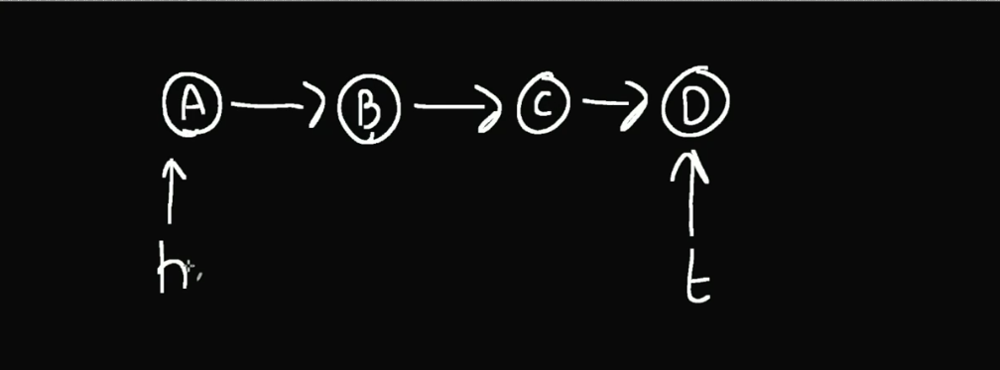
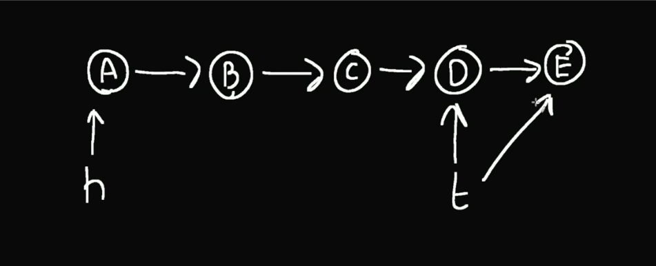
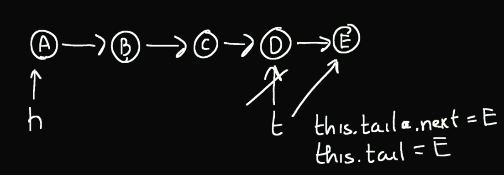

## Queue

A Queue is a simply strucute of `first in first out`.

**Head and Tail**

So if u have a strcuture of first in and first out, what we need to specify is that, everytime we gonna have a pointer to the last element, and to the first.

    h: Head | t: Tail

So if we have a directed linkedList (where each node points only to the next node):

So now, your tail is pointing to `D`, and if we want to add an element to it, we go with a logic, base in the tail pointer.

    Hey tail, whatever u are, now point to this new `E` element, and then tail becomes this element

After change the pointer, we gotta change the value: `tail = E`

**First In First Out**

So now, we understand how we add values to this structure, and in queue we want that, the first element add, is the first removed, or used, it depends, on for what u going to use that queue.
Think in the Queue like the name would be in normal day, first person in the queue first to be attended.

So to use the head element, we need to make the same operation as adding.
    Hey head whatever u are, point your next to the next element next 